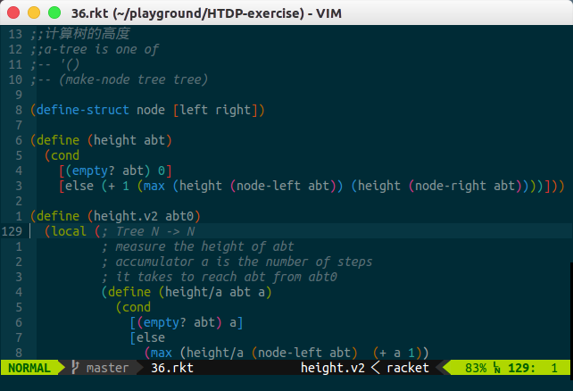

    Title: vim italic
    Date: 2016-07-17T00:13:17
    Tags: vim,斜体,注释



<!-- more -->

首先,你需要确保你的终端支持斜体显示,在终端输入

``` bash
echo -e "\e[3m foo \e[23m"
```

如果你看到了斜体的*foo*就可以了,不然的话就意味着你需要换终端了(我用的是gnome terminal)

然后你需要帮助vim知道你使用的终端类型,在你的`~/.bashrc`中加入

```bash
export TERM="xterm-256color"
```

现在看看是否可以正常显示斜体了,打开一个新文件`vim foo.html`,输入以下内容
```
<i>foo</i>
```
你看到了斜体的`foo`了吗?如果没有那么继续(我也没有),在你得`~/.vimrc`中加入下面内容

```bash
set t_ZH=^[[3m
set t_ZR=^[[23m
```
**注意**   `^[`不是两个分开的字符,这是一个整体代表`ESC`键,`CTRL+V+ESC`就可以打出来了(在vim中)

ok 你现在再打开`foo.html`就应该可以看到斜体的*foo*了

如果你希望将你的注释都设置为斜体,在`~/.vimrc`中加入以下内容
要在颜色设置的后面

```bash
highlight Comment cterm=italic
```

ok,so nice   :)


